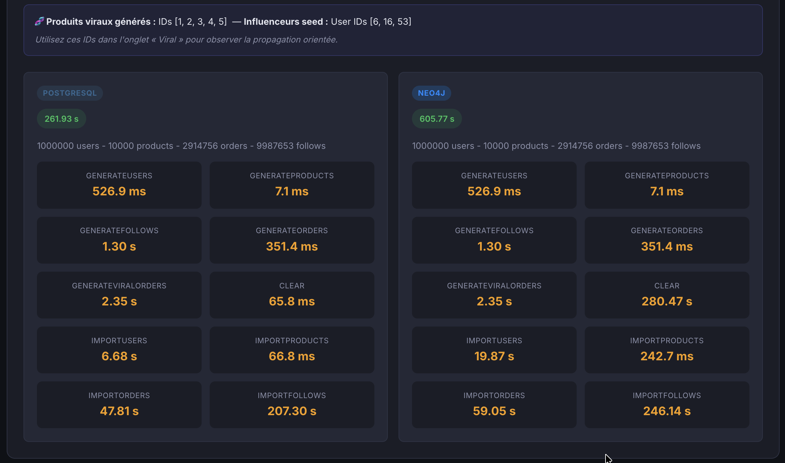
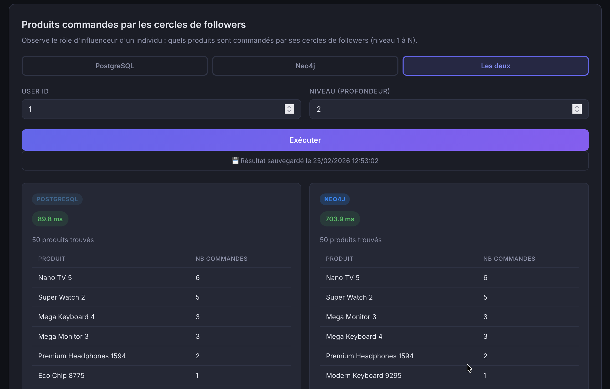
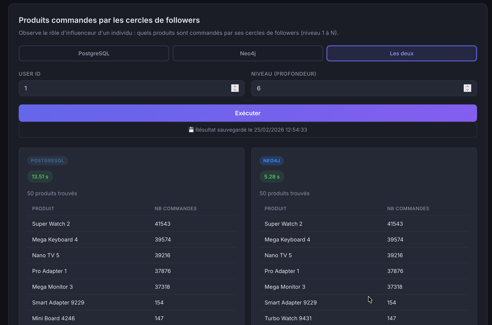
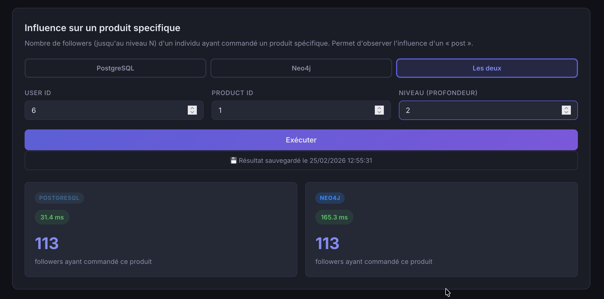
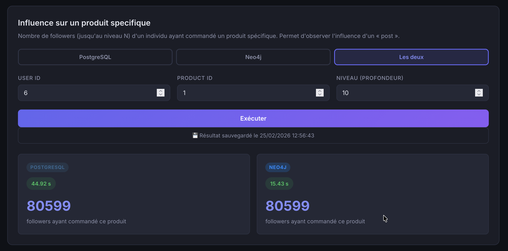

# Rapport TP NoSQL — Comparaison PostgreSQL vs Neo4j

## Analyse d'influence en réseau social

**Réalisé par :** Evan VITALIS & Simon BOURLIER

**Dépôt GitHub :** [https://github.com/InaneInaccompli/imtminesales-tpnosql](https://github.com/InaneInaccompli/imtminesales-tpnosql)

---

## Table des matières

1. [Introduction](#1-introduction)
2. [Modèle de données](#2-modèle-de-données)
3. [Architecture logicielle](#3-architecture-logicielle)
4. [Requêtes implémentées](#4-requêtes-implémentées)
5. [Résultats et performances](#5-résultats-et-performances)
6. [Analyse des résultats](#6-analyse-des-résultats)
7. [Conclusion](#7-conclusion)

---

## 1. Introduction

L'objectif de ce TP est de comparer les performances d'un **SGBDR** (PostgreSQL) et d'une **base de données NoSQL orientée graphe** (Neo4j) dans le contexte d'une application d'analyse d'influence en réseau social.

Le cas d'usage simulé est celui d'un réseau social où des utilisateurs se suivent mutuellement et commandent des produits. On cherche à répondre à des questions d'analyse d'influence : quels produits sont populaires dans les cercles de followers d'un individu, quelle est l'influence d'un utilisateur sur l'achat d'un produit spécifique, et comment se propage un produit de manière virale à travers le graphe social.

**Volumétrie cible :**

| Entité | Volume |
|---|---|
| Utilisateurs | 1 000 000 |
| Produits | 10 000 |
| Commandes par utilisateur | 0 – 5 (aléatoire) |
| Followers par utilisateur | 0 – 20 (aléatoire) |

---

## 2. Modèle de données

### 2.1 Modèle relationnel (PostgreSQL)

Le schéma PostgreSQL est composé de 4 tables :

```sql
CREATE TABLE users (
    id INTEGER PRIMARY KEY,
    name VARCHAR(255),
    email VARCHAR(255)
);

CREATE TABLE products (
    id INTEGER PRIMARY KEY,
    name VARCHAR(255),
    price NUMERIC(10, 2)
);

CREATE TABLE orders (
    user_id INT REFERENCES users(id),
    product_id INT REFERENCES products(id),
    PRIMARY KEY (user_id, product_id)
);

CREATE TABLE follows (
    follower_id INT REFERENCES users(id),
    followee_id INT REFERENCES users(id),
    PRIMARY KEY (follower_id, followee_id)
);
```

Des **index critiques** ont été ajoutés pour optimiser les requêtes récursives sur gros volume :

```sql
CREATE INDEX idx_follows_followee ON follows(followee_id);
CREATE INDEX idx_follows_follower ON follows(follower_id);
CREATE INDEX idx_orders_user ON orders(user_id);
CREATE INDEX idx_orders_product ON orders(product_id);
```

### 2.2 Modèle graphe (Neo4j)

Le modèle Neo4j utilise **2 types de nœuds** et **2 types de relations** :

- **Nœuds** :
  - `(:User {id, name, email})` — avec contrainte d'unicité sur `id`
  - `(:Product {id, name, price})` — avec contrainte d'unicité sur `id`
- **Relations** :
  - `(:User)-[:FOLLOWS]->(:User)` — relation de suivi
  - `(:User)-[:ORDERED]->(:Product)` — commande d'un produit

Les contraintes d'unicité servent aussi d'index pour les lookups par `id`.

### 2.3 Comparaison des modèles

| Aspect | PostgreSQL | Neo4j |
|---|---|---|
| Structure | Tables, lignes, jointures | Nœuds, relations, propriétés |
| Relations `follows` | Table de liaison + index | Relations natives `FOLLOWS` |
| Traversée en profondeur | CTE récursive (`WITH RECURSIVE`) | Pattern matching (`*1..N`) |
| Index | Explicites (B-Tree) | Implicites via contraintes + index-free adjacency |

---

## 3. Architecture logicielle

### 3.1 Vue d'ensemble

L'application suit une architecture **3-tiers** conteneurisée avec Docker Compose :

```
┌──────────────────────────────────────────────────────────────────┐
│                        Docker Compose                            │
│                                                                  │
│  ┌───────────────┐   ┌──────────────┐   ┌──────────────────────┐ │
│  │  Frontend     │   │   Backend    │   │   Bases de données   │ │
│  │  React (CRA)  │──▶│  Express.js  │──▶│  PostgreSQL          │ │
│  │  :3000        │   │  :5000       │   │  Neo4j               │ │
│  └───────────────┘   └──────────────┘   │  SQLite (résultats)  │ │
│                                         └──────────────────────┘ │
└──────────────────────────────────────────────────────────────────┘
```

### 3.2 Pattern DAL (Data Abstract Layer)

Le cœur de l'architecture backend repose sur un **pattern DAO abstrait** permettant d'avoir une interface unique pour les deux connecteurs :

```
AbstractDAO (classe abstraite)
    ├── connect() / close()
    ├── clearDatabase()
    ├── importUsers() / importProducts() / importOrders() / importFollows()
    ├── getTopProductsByFollowers(userId, level)
    ├── getProductFollowerCount(userId, productId, level)
    └── findViralNetwork(productId, maxLevel)
         │
         ├── PostgresDAO (implémentation SQL + CTE récursives)
         └── Neo4jDAO (implémentation Cypher)
```

Cette conception respecte le **principe d'inversion de dépendance** : le contrôleur (`mainController.js`) instancie les deux DAO et délègue les opérations sans connaître les détails d'implémentation. L'IHM permet de choisir la base cible (PostgreSQL, Neo4j, ou les deux) pour chaque opération.

### 3.3 Composants frontend

L'interface React est organisée en **4 onglets** :

| Onglet | Description | Composant |
|---|---|---|
| **Remplissage BDD** | Import de données avec paramétrage flexible | `ImportTab.jsx` |
| **Followers** | Produits commandés par les cercles de followers | `RecommendedTab.jsx` |
| **Produit spécifique** | Nombre de followers ayant commandé un produit | `AdoptionTab.jsx` |
| **Viral** | Détection de propagation virale | `ViralTab.jsx` |

Des composants réutilisables (`DbSelector`, `ResultCard`, `TimeBadge`) assurent une présentation homogène des résultats avec les temps d'exécution.

### 3.4 Flexibilité

Le logiciel offre un maximum de flexibilité :

- **Import** : nombre d'utilisateurs, de produits, max commandes/user, max followers/user sont tous paramétrables via l'IHM
- **Requêtes** : le niveau de profondeur est ajustable (de 1 à N) pour tester l'impact de la profondeur de traversée sur les performances
- **Progression** : l'import utilise des **Server-Sent Events (SSE)** pour afficher la progression en temps réel
- **Historique** : les résultats sont sauvegardés dans SQLite et rechargés automatiquement au lancement

### 3.5 Optimisations

#### PostgreSQL
- `shared_buffers=512MB`, `work_mem=64MB`, `maintenance_work_mem=256MB`
- `synchronous_commit=off` pour accélérer les écritures
- `wal_level=minimal` pour réduire l'overhead des WAL
- Import en bulk (`INSERT ... VALUES (...),...`) par batchs de 20 000

#### Neo4j
- Heap : 2G initial → 4G max
- Page cache : 2G
- Transaction memory illimitée (`total_max=0`)
- Import via `UNWIND $batch AS row` par batchs de 20 000 avec mécanisme de retry (3 tentatives)

---

## 4. Requêtes implémentées

### 4.1 Requête 1 — Produits commandés par les cercles de followers

**Objectif** : Pour un utilisateur donné, trouver les produits les plus commandés par ses followers jusqu'au niveau N de profondeur.

**PostgreSQL** (CTE récursive) :
```sql
WITH RECURSIVE followers_cte AS (
    SELECT follower_id, 1 as depth
    FROM follows WHERE followee_id = $1 AND follower_id <> $1
    UNION
    SELECT f.follower_id, cte.depth + 1
    FROM follows f
    JOIN followers_cte cte ON f.followee_id = cte.follower_id
    WHERE cte.depth < $2 AND f.follower_id <> $1
),
distinct_followers AS (
    SELECT DISTINCT follower_id FROM followers_cte
)
SELECT p.name, COUNT(DISTINCT df.follower_id)::int as count
FROM distinct_followers df
JOIN orders o ON df.follower_id = o.user_id
JOIN products p ON o.product_id = p.id
GROUP BY p.name ORDER BY count DESC LIMIT 50;
```

**Neo4j** (Cypher pattern matching) :
```cypher
MATCH (u:User {id: $userId})<-[:FOLLOWS*1..N]-(follower)
WHERE follower <> u
WITH DISTINCT follower
MATCH (follower)-[:ORDERED]->(p:Product)
RETURN p.name AS name, COUNT(DISTINCT follower) AS count
ORDER BY count DESC LIMIT 50
```

### 4.2 Requête 2 — Influence sur un produit spécifique

**Objectif** : Pour un utilisateur et un produit donnés, compter le nombre de followers (jusqu'au niveau N) ayant commandé ce produit.

**PostgreSQL** : même CTE récursive que la requête 1, avec un filtre supplémentaire `WHERE o.product_id = $3`.

**Neo4j** :
```cypher
MATCH (u:User {id: $userId})<-[:FOLLOWS*1..N]-(follower)
WHERE follower <> u
WITH DISTINCT follower
MATCH (follower)-[:ORDERED]->(p:Product {id: $productId})
RETURN COUNT(DISTINCT follower) AS count
```

### 4.3 Requête 3 — Détection de réseau viral

**Objectif** : Pour un produit donné, explorer toute la base pour trouver le réseau viral le plus étendu. La propagation est orientée : un follower ne propage que s'il a lui-même acheté le produit.

Cette requête est la plus complexe car elle implique :
1. Identification des « racines pures » (acheteurs n'étant followers d'aucun autre acheteur)
2. BFS orienté depuis chaque racine
3. Agrégation par cercle de profondeur
4. Sélection de la meilleure racine

---

## 5. Résultats et performances

### 5.1 Injection de données

L'import a été réalisé avec les paramètres par défaut (1M users, 10K produits, 0-5 commandes/user, 0-20 followers/user).

<p align="center">
  
</p>

*Figure 1 — Résultats de l'import : temps d'injection pour PostgreSQL et Neo4j.*

L'import en bulk via `INSERT ... VALUES` (PostgreSQL) et `UNWIND` (Neo4j) est critique pour obtenir des temps raisonnables sur 1M utilisateurs. Les batchs de 20 000 éléments permettent un bon compromis entre overhead réseau et utilisation mémoire.

### 5.2 Requête 1 — Produits commandés par les cercles de followers (profondeur faible)

<p align="center">
  
</p>

*Figure 2 — Requête « Followers » avec un niveau de profondeur faible : comparaison PostgreSQL vs Neo4j.*

### 5.3 Requête 1 — Produits commandés par les cercles de followers (profondeur élevée)

<p align="center">
  
</p>

*Figure 3 — Requête « Followers » avec un niveau de profondeur élevé : comparaison PostgreSQL vs Neo4j.*

### 5.4 Requête 2 — Influence sur un produit spécifique (profondeur faible)

<p align="center">
  
</p>

*Figure 4 — Requête « Produit spécifique » avec un niveau de profondeur faible : comparaison PostgreSQL vs Neo4j.*

### 5.5 Requête 2 — Influence sur un produit spécifique (profondeur élevée)

<p align="center">
  
</p>

*Figure 5 — Requête « Produit spécifique » avec un niveau de profondeur élevé : comparaison PostgreSQL vs Neo4j.*

---

## 6. Analyse des résultats

### 6.1 Performances d'injection

L'import de données massives (1M utilisateurs, ~10M follows, ~2.5M commandes) montre que :

- **PostgreSQL** bénéficie fortement de l'insertion en bulk (`INSERT ... VALUES`) et des paramètres d'optimisation (`synchronous_commit=off`, WAL minimal). Le moteur relationnel est très efficace pour les écritures en batch grâce à son système de journalisation optimisé.
- **Neo4j** est naturellement plus lent à l'import car chaque nœud et chaque relation doivent être indexés individuellement dans le graphe. Le mécanisme de `UNWIND` avec batch de 20 000 et le retry automatique permettent de rendre l'opération fiable, mais le surcoût de la gestion du graphe reste significatif.

### 6.2 Performances de recherche

#### Profondeur faible (niveau 1-2)

À faible profondeur, les deux systèmes affichent des performances comparables. Les raisons :

- **PostgreSQL** : la CTE récursive ne fait qu'une ou deux itérations. Les index sur `follows(followee_id)` et `orders(user_id)` permettent des jointures rapides. Le planificateur de requêtes SQL optimise efficacement ce cas.
- **Neo4j** : la traversée est limitée à 1 ou 2 sauts. L'*index-free adjacency* (chaque nœud contient un pointeur direct vers ses voisins) rend chaque saut en O(1) en termes d'accès.

#### Profondeur élevée (niveau 3+)

C'est à profondeur élevée que les différences deviennent significatives :

- **Neo4j excelle** pour les traversées en profondeur grâce à son architecture native de graphe. Le pattern `[:FOLLOWS*1..N]` est traduit en traversée directe du graphe sans aucune jointure. La complexité est **proportionnelle au nombre de nœuds traversés**, pas à la taille de la table.
- **PostgreSQL souffre** car la CTE récursive doit effectuer à chaque niveau une jointure complète entre l'ensemble des followers déjà trouvés et la table `follows`. Même avec les index B-Tree, le nombre de jointures croît exponentiellement avec la profondeur. Le `UNION` (pour éviter les cycles) ajoute un surcoût de dédoublonnage.

### 6.3 Synthèse comparative

| Critère | PostgreSQL | Neo4j |
|---|---|---|
| **Injection de données** | ✅ Plus rapide (bulk INSERT optimisé) | ❌ Plus lent (indexation graphe) |
| **Requêtes profondeur faible (1-2)** | ✅ Comparable / légèrement plus rapide | ✅ Comparable |
| **Requêtes profondeur élevée (3+)** | ❌ Dégradation exponentielle | ✅ Traversée native, quasi-linéaire |
| **Flexibilité du modèle** | Schéma rigide mais éprouvé | Schéma flexible, naturel pour les graphes |
| **Complexité des requêtes** | CTE récursives complexes à écrire | Cypher expressif et concis |

### 6.4 Quand utiliser quelle base ?

- **PostgreSQL** est préférable quand :
  - Les requêtes sont principalement relationnelles (agrégations, filtres, jointures simples)
  - Les traversées de graphe sont peu profondes (1-2 niveaux)
  - Le volume d'écriture est élevé et doit être rapide
  - Le modèle de données est stable et bien défini

- **Neo4j** est préférable quand :
  - Le cas d'usage est centré sur les relations entre entités (réseaux sociaux, recommandations, détection de fraude)
  - Les traversées en profondeur sont fréquentes et profondes (3+ niveaux)
  - L'expressivité des requêtes de graphe prime sur la performance d'écriture
  - Le modèle de données évolue fréquemment (ajout de types de relations)

---

## 7. Conclusion

Ce TP a permis de mettre en évidence les forces et faiblesses de chaque paradigme de base de données dans un contexte d'analyse d'influence en réseau social.

**Le SGBDR PostgreSQL** se distingue par sa robustesse, ses performances d'injection, et sa capacité à gérer efficacement des requêtes de faible profondeur. Les CTE récursives offrent une solution fonctionnelle pour les traversées de graphe, mais leur performance se dégrade rapidement avec la profondeur.

**La base orientée graphe Neo4j** s'impose naturellement dès que les requêtes impliquent des traversées en profondeur du réseau social. Son architecture d'*index-free adjacency* et la concision du langage Cypher en font un outil idéal pour ce type de problématique.

L'architecture logicielle développée, avec sa **couche DAL abstraite** et son **IHM unique** offrant le choix de la base, permet de comparer objectivement les deux systèmes sur les mêmes données et les mêmes requêtes. Le mécanisme de SSE pour le suivi de l'import en temps réel, la flexibilité des paramètres (volumétrie, profondeur), et la sauvegarde automatique des résultats dans SQLite en font un outil d'analyse réutilisable.

**En résumé** : le choix entre un SGBDR et une base orientée graphe dépend fondamentalement de la profondeur des traversées relationnelles requises. Pour des analyses superficielles (1-2 niveaux), PostgreSQL est suffisant et souvent plus performant. Pour des analyses en profondeur (3+ niveaux), Neo4j offre un avantage décisif en termes de performances et d'expressivité des requêtes.
